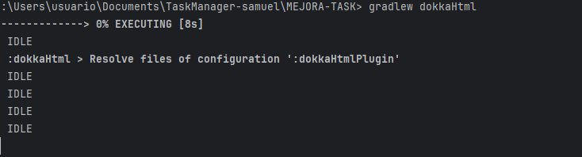
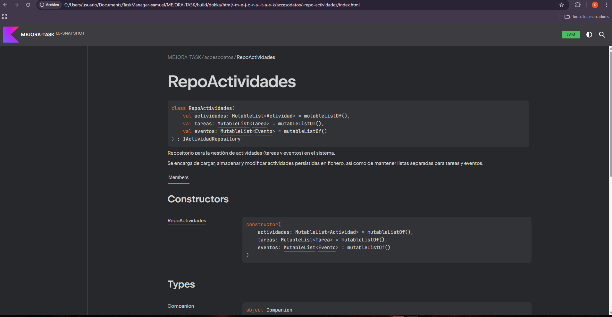

1. Comentarios KDoc:

TAREA.KT 
```kotlin
package dominio

/**
 * Representa una tarea que puede tener subtareas y un estado asociado.
 *
 * Hereda de [Actividad] y añade funcionalidades específicas para la gestión de tareas,
 * como el manejo de subtareas, etiquetas y estados.
 *
 * @property etiqueta Etiqueta asociada a la tarea.
 * @property estado Estado actual de la tarea.
 * @property subTareas Lista de subtareas asociadas a esta tarea.
 */
class Tarea private constructor(
    descripcion: String,
    usuario: String,
    val etiqueta: EtiquetasTareas
) : Actividad(descripcion, usuario) {

    init {
        contador += 1
    }

    /**
     * Estado actual de la tarea.
     */
    var estado = EstadoTarea.ABIERTA

    /**
     * Lista de subtareas asociadas a esta tarea.
     */
    val subTareas: MutableList<Tarea> = mutableListOf()

    /**
     * Constructor secundario para crear una tarea con todos los datos.
     *
     * @param usuario Usuario creador de la tarea.
     * @param id Identificador de la tarea.
     * @param etiqueta Etiqueta asociada.
     * @param fechaCreacion Fecha de creación.
     * @param descripcion Descripción de la tarea.
     * @param estado Estado de la tarea en formato String.
     */
    private constructor(
        usuario: String,
        id: String,
        etiqueta: EtiquetasTareas,
        fechaCreacion: String,
        descripcion: String,
        estado: String
    ) : this(usuario, descripcion, etiqueta) {
        this.id = id + contador
        this.fechaCreacion = fechaCreacion
        this.estado = EstadoTarea.getEstado(estado)!!
    }

    /**
     * Devuelve el detalle completo de la tarea, incluyendo subtareas.
     *
     * @return Cadena con la información detallada de la tarea.
     */
    override fun obtenerDetalle(): String {
        val subTareasDetalle = if (subTareas.isEmpty()) {
            "Sin subtareas"
        } else {
            subTareas.joinToString(separator = "\n") { "    - ${it.obtenerDetalle()}" }
        }
        return super.obtenerDetalle() + ";$estado;$etiqueta;\nSubtareas:\n$subTareasDetalle"
    }

    /**
     * Actualiza el estado de la tarea y de todas sus subtareas.
     *
     * @param estado Nuevo estado a asignar.
     */
    fun actualizarEstado(estado: EstadoTarea) {
        this.estado = estado
        for (tarea in subTareas) {
            tarea.estado = estado
        }
    }

    /**
     * Agrega una subtarea a la lista, validando que no existan duplicados ni subtareas anidadas.
     *
     * @param subTarea Subtarea a agregar.
     * @throws IllegalArgumentException Si la subtarea ya tiene sus propias subtareas.
     */
    fun agregarSubTarea(subTarea: Tarea) {
        if (!subTareas.contains(subTarea)) {
            if (subTarea.subTareas.isNotEmpty()) {
                throw IllegalArgumentException("Una subtarea no puede tener más subtareas.")
            }
            subTareas.add(subTarea)
        } else {
            println("La subtarea ya existe, no se añadirá de nuevo.")
        }
    }

    companion object {
        /**
         * Contador global de tareas creadas.
         */
        var contador = 0

        /**
         * Crea una nueva instancia de [Tarea] con los parámetros básicos.
         *
         * @param descripcion Descripción de la tarea.
         * @param usuario Usuario creador.
         * @param etiqueta Etiqueta asociada.
         * @return Nueva instancia de [Tarea].
         */
        fun creaInstancia(descripcion: String, usuario: String, etiqueta: EtiquetasTareas): Tarea {
            return Tarea(descripcion, usuario, etiqueta)
        }

        /**
         * Crea una nueva instancia de [Tarea] con todos los datos.
         *
         * @param usuario Usuario creador.
         * @param id Identificador de la tarea.
         * @param etiqueta Etiqueta asociada.
         * @param fechaCreacion Fecha de creación.
         * @param descripcion Descripción de la tarea.
         * @param estado Estado de la tarea en formato String.
         * @return Nueva instancia de [Tarea].
         */
        fun creaInstancia(
            usuario: String,
            id: String,
            etiqueta: EtiquetasTareas,
            fechaCreacion: String,
            descripcion: String,
            estado: String
        ): Tarea {
            return Tarea(usuario, id, etiqueta, fechaCreacion, descripcion, estado)
        }
    }
}
```
CACULOID.KT

```Kotlin
package dominio

import java.io.File

/**
 * Clase abstracta para el cálculo y gestión de identificadores únicos basados en fechas.
 *
 * Su objetivo es generar un identificador incremental único para cada fecha dada,
 * almacenando la relación fecha-id en memoria y en un fichero persistente.
 *
 * El identificador se utiliza, por ejemplo, para asignar IDs únicos a eventos o tareas
 * creados en el sistema en una fecha concreta.
 */
abstract class CalculoId {
    companion object {
        /**
         * Lista de fechas únicas registradas.
         */
        private val fechasUnicas = mutableListOf<String>()

        /**
         * Mapa que asocia cada fecha con su identificador incremental.
         */
        private val mapaIdsFechas: MutableMap<String, Int> = mutableMapOf()

        /**
         * Ruta del fichero donde se almacenan las fechas y sus IDs.
         */
        const val RUTA_FICHERO_FECHAS = "MEJORA-TASK/src/main/kotlin/Datos/FechasId.txt"

        init {
            // Carga las fechas e IDs existentes desde el fichero al iniciar la clase.
            cargarFechasDesdeFichero()
        }

        /**
         * Genera un identificador único para una fecha dada.
         *
         * Si la fecha es nueva, se le asigna un nuevo ID incremental y se guarda en el fichero.
         * Si la fecha ya existe, devuelve el ID previamente asignado.
         *
         * @param fecha Fecha en formato `dd-MM-yyyy`.
         * @return Identificador único asociado a la fecha.
         * @throws IllegalArgumentException Si la fecha es nula o vacía.
         */
        fun generarId(fecha: String?): Int {
            require(!fecha.isNullOrBlank()) { "Error: La fecha no puede ser nula o vacía." }

            return if (fecha !in fechasUnicas) {
                fechasUnicas.add(fecha)
                val id = fechasUnicas.size
                File(RUTA_FICHERO_FECHAS).appendText("Fecha:$fecha ID:$id\n")
                mapaIdsFechas[fecha] = id
                id
            } else {
                mapaIdsFechas[fecha] ?: error("Error: La fecha $fecha no tiene un ID asignado.")
            }
        }

        /**
         * Carga las fechas e identificadores desde el fichero persistente.
         *
         * Si el fichero no existe, lo crea vacío.
         * Procesa cada línea con el formato `Fecha:<fecha> ID:<id>`.
         */
        private fun cargarFechasDesdeFichero() {
            val archivo = File(RUTA_FICHERO_FECHAS)
            if (!archivo.exists()) {
                archivo.createNewFile()
                return
            }

            archivo.forEachLine { linea ->
                try {
                    val partes = linea.split(" ")
                    val fecha = partes[0].split(":")[1]
                    val id = partes[1].split(":")[1].toInt()
                    fechasUnicas.add(fecha)
                    mapaIdsFechas[fecha] = id
                } catch (e: Exception) {
                    println("Error al procesar la línea del fichero: $linea. Detalle: ${e.message}")
                }
            }
        }
    }
}
```

RepoActividad.kt
```kotlin
package accesodatos

import dominio.Actividad
import dominio.EstadoTarea
import dominio.Evento
import dominio.Tarea
import servicios.ControlDeHistorial
import java.io.File
import java.nio.file.Paths

/**
 * Repositorio para la gestión de actividades (tareas y eventos) en el sistema.
 *
 * Se encarga de cargar, almacenar y modificar actividades persistidas en fichero,
 * así como de mantener listas separadas para tareas y eventos.
 *
 * @property actividades Lista general de todas las actividades.
 * @property tareas Lista específica de tareas.
 * @property eventos Lista específica de eventos.
 */
class RepoActividades(
    override val actividades: MutableList<Actividad> = mutableListOf(),
    override val tareas: MutableList<Tarea> = mutableListOf(),
    override val eventos: MutableList<Evento> = mutableListOf()
) : IActividadRepository {

    init {
        cargarActividades()
    }

    /**
     * Carga las actividades desde el fichero persistente y las añade a las listas correspondientes.
     */
    private fun cargarActividades() {
        val ficheroActividades = Utils.leerArchivo(RUTA_FICHERO_ACTIVIDADES)
        for (linea in ficheroActividades) {
            procesarLineaActividad(linea)
        }
    }

    /**
     * Procesa una línea del archivo de actividades y la convierte en un objeto Actividad.
     * Si la actividad no existe ya en la lista, se añade a la lista correspondiente.
     *
     * @param linea La línea del archivo que representa una actividad.
     */
    private fun procesarLineaActividad(linea: String) {
        try {
            val actividad = Utils.deserializarActividad(linea)
            if (actividad != null && !actividades.contains(actividad)) {
                actividades.add(actividad)
                when (actividad) {
                    is Tarea -> tareas.add(actividad)
                    is Evento -> eventos.add(actividad)
                }
            }
        } catch (e: Exception) {
            println("Error al cargar una actividad desde el fichero: ${e.message}")
        }
    }

    /**
     * Cambia el estado de una tarea y actualiza el fichero de actividades.
     *
     * @param tarea Tarea a modificar.
     * @param historial Controlador de historial para registrar el cambio.
     * @param estadoTarea Nuevo estado a asignar.
     */
    fun cambiarEstado(tarea: Tarea, historial: ControlDeHistorial, estadoTarea: EstadoTarea) {
        val id = tarea.getIdActividad()
        tarea.estado = estadoTarea
        val archivo = File(RUTA_FICHERO_ACTIVIDADES)

        archivo.writeText("") // Limpiar el archivo antes de escribir

        tareas.forEach { tareaPrincipal ->
            archivo.appendText("${tareaPrincipal.obtenerDetalle()}\n")

            if (tareaPrincipal is Tarea && tareaPrincipal.subTareas.isNotEmpty()) {
                tareaPrincipal.subTareas.forEach { subTarea ->
                    archivo.appendText("    - ${subTarea.obtenerDetalle()}\n")
                }
            }
        }

        println("¡Tarea cerrada con éxito!")
        historial.agregarHistorial("Tarea con id $id con estado cambiado a $estadoTarea con éxito")
    }

    /**
     * Añade una nueva actividad al repositorio y la persiste en el fichero.
     * Evita duplicados en las listas.
     *
     * @param actividad Actividad a añadir.
     */
    fun aniadirActividad(actividad: Actividad) {
        if (!actividades.contains(actividad)) {
            actividades.add(actividad)

            when (actividad) {
                is Tarea -> if (!tareas.contains(actividad)) tareas.add(actividad)
                is Evento -> if (!eventos.contains(actividad)) eventos.add(actividad)
            }

            Utils.aniadirActividad(RUTA_FICHERO_ACTIVIDADES, actividad)
        } else {
            println("La actividad ya existe, no se añadirá de nuevo.")
        }
    }

    companion object {
        /**
         * Ruta relativa del fichero de actividades.
         */
        val ruta_relativa = "MEJORA-TASK/src/main/kotlin/Datos/Actividades.txt"
        /**
         * Ruta absoluta del fichero de actividades.
         */
        val RUTA_FICHERO_ACTIVIDADES = Paths.get(ruta_relativa).toAbsolutePath().toString()
    }
}
```

2. Generación con Dokka:




aqui podemos ver la pagina web generada por dokka:

