# Revsion de codigo 
Hacemos  click derecho en src - analyze - inspect code
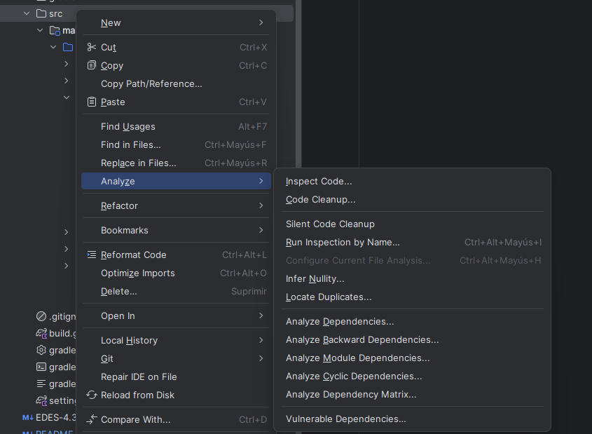

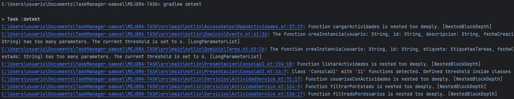

Estos son los resulatados que nos dan:

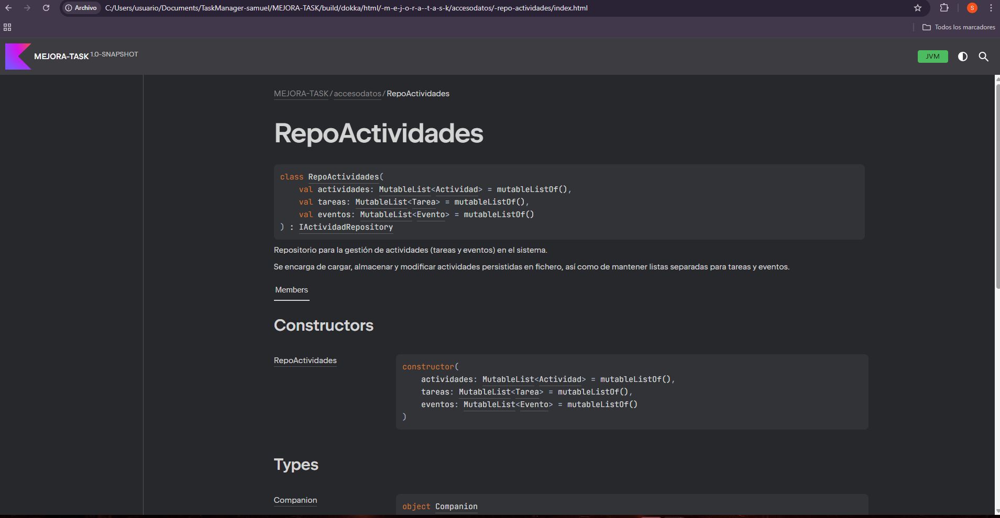

vamos a ver 5 tipos de errrores:

-Probable bugs
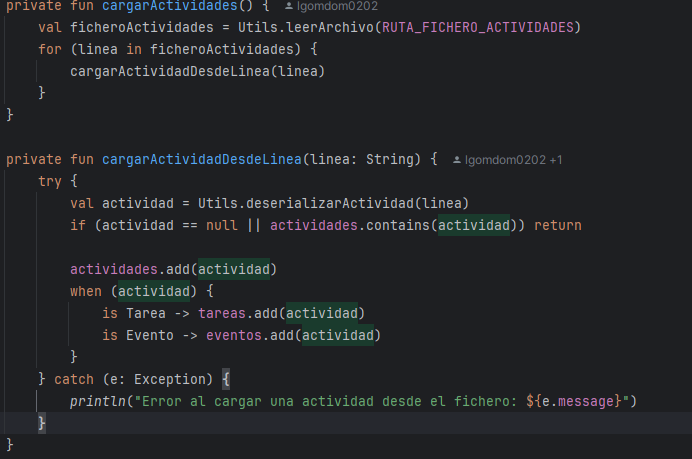

-Redundant constructs

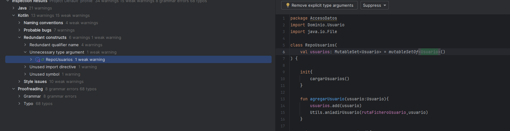

-Style issues

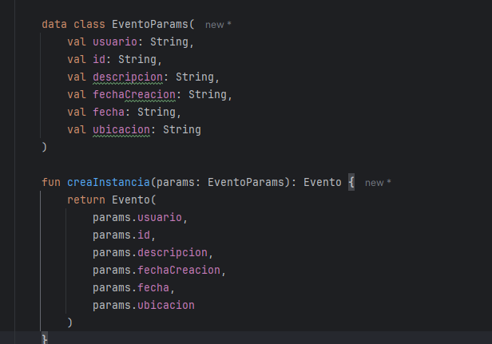

-Grammar

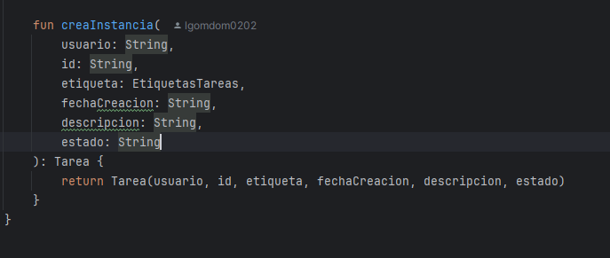

-Typo

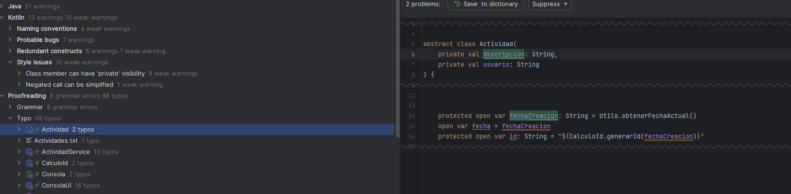

APLICACIÓN DE REFACTORIZACIONES

1: Extracción de método

Lo vamos hacer con  repousuarios.kt

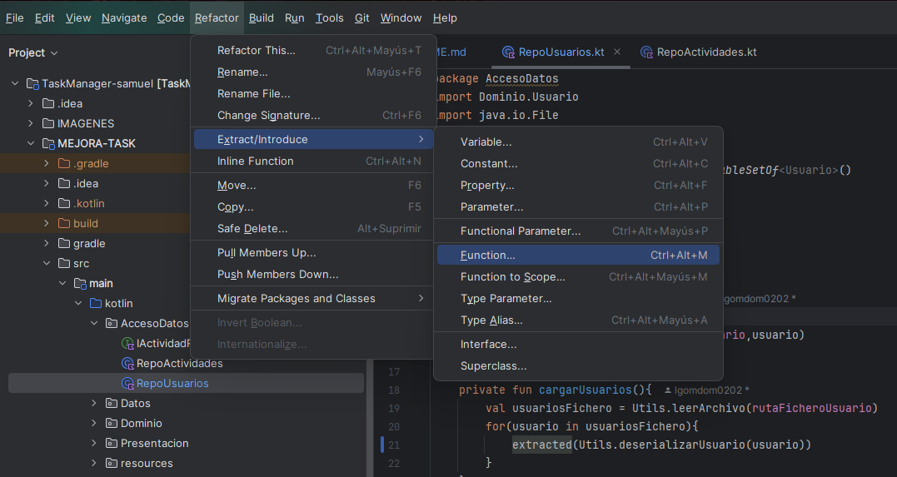

despues de la refactorización:

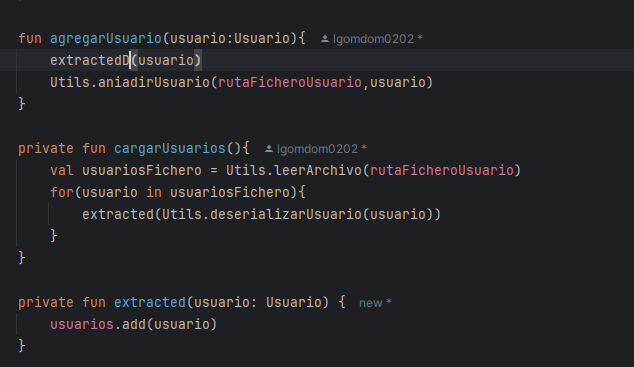

2: Introducir parámetro objeto

Lo vamos hacer con  evento.kt

dewspues de la refactorización:

3: Quitar código redundante

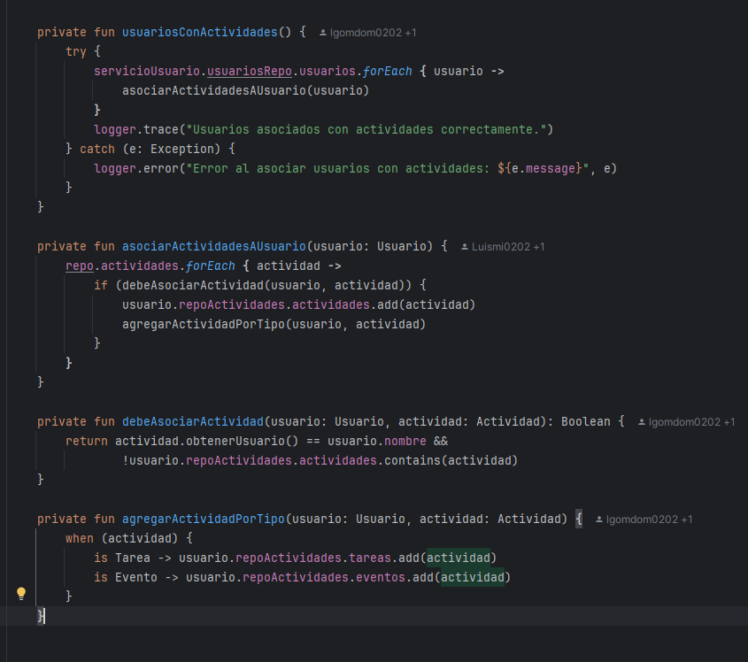

despues de la refactorización:

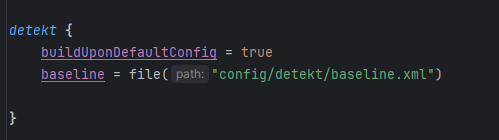
