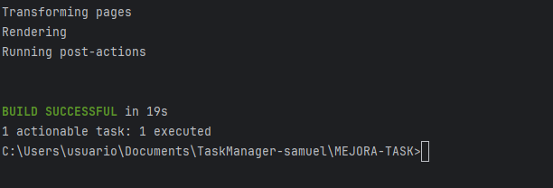

# Revsion de codigo 
Hacemos  click derecho en src - analyze - inspect code




Estos son los resulatados que nos dan:


vamos a ver 5 tipos de errrores:

-Probable bugs


-Redundant constructs


-Style issues


-Grammar


-Typo


APLICACIÓN DE REFACTORIZACIONES

1: Extracción de método

Lo vamos hacer con  repousuarios.kt


despues de la refactorización:


2: Introducir parámetro objeto

Lo vamos hacer con  evento.kt


despues de la refactorización:


3: Quitar código redundante


despues de la refactorización:


Desarrollo de pruebas:

aqui tienes  las pruebas de cada uno de los metodos que hemos refactorizado

eventotest.kt

```kotlin

import dominio.Evento
import dominio.EventoParams
import org.junit.jupiter.api.Assertions.*
import org.junit.jupiter.api.Test

class EventoTest {
    
    @Test
    fun testCrearEventoConConstructorAntiguo() {
        val evento = Evento.creaInstancia(
            "Descripción", "Usuario", "Ubicación", "01-01-2024"
        )
        assertEquals("Descripción", evento.obtenerDesc())
        assertEquals("Usuario", evento.obtenerUsuario())
    }

   
    @Test
    fun testCrearEventoConEventoParams() {
        val params = EventoParams(
            usuario = "Usuario",
            id = "123",
            descripcion = "Descripción",
            fechaCreacion = "01-01-2024",
            fecha = "02-01-2024",
            ubicacion = "Ubicación"
        )
        val evento = Evento.creaInstancia(params)
        assertEquals("Descripción", evento.obtenerDesc())
        assertEquals("Usuario", evento.obtenerUsuario())
        assertEquals("Ubicación", evento.obtenerDetalle().split(";").last())
    }
}

```
RepositoriosTest.kt
```kotlin
import accesodatos.RepoUsuarios
import dominio.Usuario
import org.junit.jupiter.api.Assertions.*
import org.junit.jupiter.api.BeforeEach
import org.junit.jupiter.api.Test

class RepoUsuariosTest {
    private lateinit var repo: RepoUsuarios

    @BeforeEach
    fun setUp() {
        repo = RepoUsuarios(mutableSetOf())
    }

    @Test
    fun testAgregarUsuario() {
        val usuario = Usuario.creaInstancia("Luismi")
        repo.agregarUsuario(usuario)
        assertTrue(repo.usuarios.contains(usuario))
    }

    @Test
    fun testCargarUsuarios() {
        assertNotNull(repo.usuarios)
    }
}
```
estadotareaTest.kt

```kotlin
import dominio.EstadoTarea
import org.junit.jupiter.api.Assertions.*
import org.junit.jupiter.api.Test

class EstadoTareaTest {
    @Test
    fun testGetEstadoVariantes() {
        assertEquals(EstadoTarea.EN_PROGRESO, EstadoTarea.getEstado("EN PROGRESO"))
        assertEquals(EstadoTarea.EN_PROGRESO, EstadoTarea.getEstado("EN_PROGRESO"))
        assertEquals(EstadoTarea.ABIERTA, EstadoTarea.getEstado("ABIERTA"))
        assertEquals(EstadoTarea.FINALIZADA, EstadoTarea.getEstado("FINALIZADA"))
        assertNull(EstadoTarea.getEstado("NO_EXISTE"))
    }
}

```
# RESPUESTA A LAS PREGUNTAS

[1]

**1.a ¿Qué code smell y patrones de refactorización has aplicado?**

Pues se han detectado y refactorizado los siguientes code smells:


- Código duplicado y constructos redundantes: elimanación de código repetido y redundante.
- Métodos largos: métodos que hacían más de una cosa y que eran muy largos.
- Parámetros dispersos: métodos con muchos parámetros, lo que hace que el código sea más difícil de leer y mantener.

**1.b Teniendo en cuenta aquella funcionalidad que tiene pruebas unitarias, selecciona un patrón de refactorización de los que has aplicado y que están cubierto por los test unitarios. ¿Porque mejora o no mejora tu código? Asegurate de poner enlaces a tu código**

He aplicado el patrón Introducir parámetro objeto en la clase Evento, reemplazando varios parámetros sueltos por un solo objeto EventoParams. Esta refactorización está cubierta por las pruebas unitarias en EventoTest.kt, que verifican tanto el constructor antiguo como el nuevo.

Esto mejora el código porque:

- Reduce la complejidad de los métodos y facilita su uso.
- Hace el código más legible y menos propenso a errores por orden o cantidad de parámetros.
- Facilita el mantenimiento y futuras ampliaciones.

[2]

**2.a Describe el proceso que sigues para asegurarte que la refactorización no afecta a código que ya tenias desarrollado.**


[3]

**3.a ¿Que funcionalidad del IDE has usado para aplicar la refactorización seleccionada? Si es necesario, añade capturas de pantalla para identificar la funcionalidad.**

