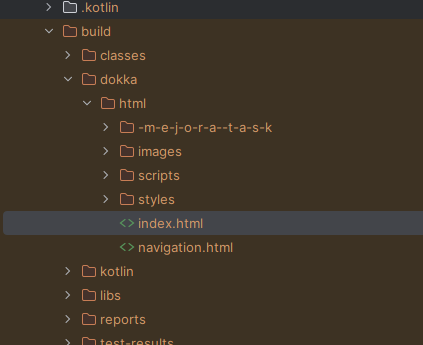

# Revsion de codigo 
Hacemos  click derecho en src - analyze - inspect code

Estos son los resulatados que nos dan:

vamos a ver 5 tipos de errrores:

-Probable bugs

-Redundant constructs

-Style issues

-Grammar

-Typo

APLICACIÓN DE REFACTORIZACIONES

1: Extracción de método

Lo vamos hacer con  repousuarios.kt

despues de la refactorización:

2: Introducir parámetro objeto

Lo vamos hacer con  evento.kt

dewspues de la refactorización:

3: Quitar código redundante

despues de la refactorización:

